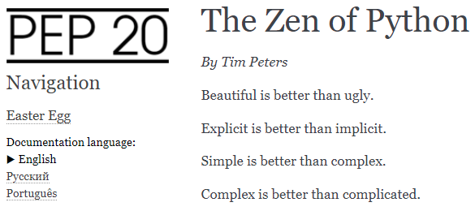
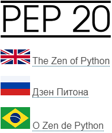

.. _switcher:

Add language switcher
---------------------

Let's create a simple language switcher and add it to the sidebar. We will also add a start page that contains links to our documentation in different languages.

Sidebar language switcher
~~~~~~~~~~~~~~~~~~~~~~~~~

The language switcher should contain all three languages: English,
Russian, and Portuguese. The current language of the page should be
displayed as text, and the other two languages should be linked to the
same page in those languages.

For example, the language switcher on easter-egg.html in English should
look like this:

.. role:: underline
    :class: underline	

+---------------------------------+
| ► English :sup:`1`              |
|                                 |
| :underline:`Русский` :sup:`2`   |
|                                 |
| :underline:`Português` :sup:`3` |
+---------------------------------+

1. Just text. The triangle indicates the current language. 

2. Link to easter-egg.html in Russian.

3. Link to easter-egg.html in Portuguese.

For the language switcher, we will use `Jinja
templates <https://www.sphinx-doc.org/en/master/templating.html>`_.
Two predefined Jinja variables are used in our template: **pagename**
and **language**.

Add language switcher to our project:

1. Create a UTF-8 encoded file, name it switcher.html and put this code
   in it:
   
   .. code-block:: jinja

	

	

	{{ heading[language] }}
	

	

	
		
		<a href = "../{{lcode}}/{{pagename}}.html">{{lname}}</a> 
		
		&#9654; {{lname}} 
		
	
	

   Alternatively, you can `download switcher.html <_static/switcher.zip>`_.

2. Place switcher.html in the **_templates** directory; by default
   Sphinx looks for Jinja templates in this directory.

3. According to the `Alabaster template
   documentation <https://alabaster.readthedocs.io/en/latest/installation.html>`_,
   add an explicit html_sidebars setting to conf.py:
   
   .. code-block:: python

	html_sidebars = {
		'**': [
			'about.html',
			'navigation.html',
			'switcher.html'    
		]
	}

   I added switcher.html to the default Alabaster sidebar and removed
   the elements that we do not need (donate.html, relations.html etc).
   As usual, you can `download the updated conf.py <_static/conf-switcher.zip>`_.

Sphinx will now use switcher.html to add the language switcher to the
sidebar of each documentation page.

After you rebuild the documentation, you can see the newly added
language switcher:

	   
For our language switcher to work, the documentation for each language
must be placed in a directory named after the language code, and these
directories must be at the same nesting level, for example:

-  <doc_directory>/**en**/<English_documentation_files>

-  <doc_directory>/**ru**/<Russian_documentation_files>

-  <doc_directory>/**pt_BR**/<Portuguese_documentation_files>

We already :ref:`built our documentation this way <build>`.

If you use a similar language switcher in your project, make sure to
keep the directories structure when you upload your documentation
online.

Start page
~~~~~~~~~~

Our start page is a simple HTML file that contains several links and images.

	   
The start page file named index.html contains the following code::

	<!DOCTYPE html>
	<html>
		<head>
			<title>PEP 20</title>
			
		</head>
		<body>
		

			

				
				
 <a href="en/index.html">The Zen of Python</a>

				
 <a href="ru/index.html">Дзен Питона</a>

				
 <a href="pt_BR/index.html">O Zen de Python</a>

			

		

		</body>
	</html>

There are four images used on the start page:

- logo_index.png for our project logo.
- en.png for the British flag.
- ru.png for the Russian flag.
- pt_BR.png for the Brazilian flag.

The images should be placed in the **img** directory at the same level as the index.html file.
You can download `index.html and the img directory <_static/start-page.zip>`_, and then place them into the **_build/html** directory of our documentation, like this::

	html
	│   index.html
	│
	├───img
	│       en.png
	│       logo_index.png
	│       pt_BR.png
	│       ru.png

You do not need to rebuild the documentation after adding the start page.
