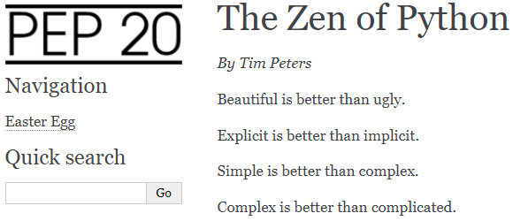

Create demo project
-------------------

Our demo project will contain information `about The Zen of Python <https://www.python.org/dev/peps/pep-0020/>`_.

To create a demo project:

1. Create a directory for the demo project::

	mkdir zen

2. Go to the demo directory::

	cd zen

3. Create a new sphinx project with sphinx-quickstart::

	sphinx-quickstart

   This command runs the Sphinx quickstart utility that asks you some
   questions about your project settings. Specify the settings as
   follows:

	> Separate source and build directories (y/n) [n]: **n**

	> Project name: **The Zen of Python**

	> Author name(s): **authoress**

	> Project release []: **1.0.0**

	> Project language [en]: **en**

   You can specify your own settings, but be sure to set the project
   language to English (en).

   After you answer all questions, the quickstart utility creates the
   project::

	zen
	│   conf.py
	│   index.rst
	│   make.bat
	│   Makefile
	│   tree.txt
	│   
	├───_build
	├───_static
	└───_templates

If you are familiar with Sphinx, you already know about index.rst,
conf.py and other default project files.

Add content
~~~~~~~~~~~

Open index.rst in any text editor and replace its content with the
following:

.. code-block:: rst

	The Zen of Python
	=================

	.. toctree::
	   :hidden:
	   :glob:

	   easter-egg.rst
		  
	*By Tim Peters*
	   
	Beautiful is better than ugly.

	Explicit is better than implicit.

	Simple is better than complex.

	Complex is better than complicated.

	Flat is better than nested.

	Sparse is better than dense.

	Readability counts.

	Special cases aren't special enough to break the rules.

	Although practicality beats purity.

	Errors should never pass silently.

	Unless explicitly silenced.

	In the face of ambiguity, refuse the temptation to guess.

	There should be one-- and preferably only one --obvious way to do it.

	Although that way may not be obvious at first unless you're Dutch.

	Now is better than never.

	Although never is often better than \*right\* now.

	If the implementation is hard to explain, it's a bad idea.

	If the implementation is easy to explain, it may be a good idea.

	Namespaces are one honking great idea -- let's do more of those!

We added easter-egg.rst to the toctree, which means that we should
create this file in the project directory. After you created the file
(it should be encoded in UTF-8), put this text in it:

.. code-block:: rst

	Easter Egg
	==========

	In Python interactive prompt, run:

	::

	>>> import this

	Enjoy your easter egg!

You can download `an archive that contains both files <../_static/rst-initial.zip>`_.

Add images
~~~~~~~~~~

To add images to the demo project:

1. Download `an archive containing two images <../_static/egg-logo.zip>`_: logo.png (demo project
   logo) and egg.png (image of an egg).

2. Unzip the archive and place both files in the **_static** directory
   of the demo project.

3. Open conf.py, find the **Options for HTML output** section. Add
   html_theme_options containing logo.png after html_theme, like
   this:
   
.. code-block:: python

    html_theme = 'alabaster'

    html_theme_options = {

    'logo' : 'logo.png'

    }

4. Add egg.png to easter-egg.rst, like this:

.. code-block:: rst

    Enjoy your easter egg!

    .. image:: _static/egg.png

You can `download conf.py and easter-egg.rst <../_static/conf-easter-egg.zip>`_ that already contain both
additions.

Note that if you specified your own settings when creating the project,
they will be overwritten by the settings from the downloaded conf.py.

Generate html
~~~~~~~~~~~~~

Generate an html output to make sure everything works as expected::

	make html

If the build is successful, the **_build/html** directory contains
the html output::

	html
	│   .buildinfo
	│   easter-egg.html
	│   genindex.html
	│   index.html
	│   objects.inv
	│   search.html
	│   searchindex.js
	│   
	├───_images       
	├───_sources       
	└───_static

If you open index.html in a browser, you should see the demo project:

