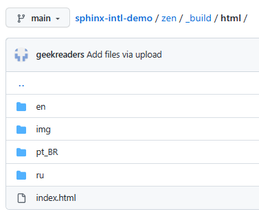
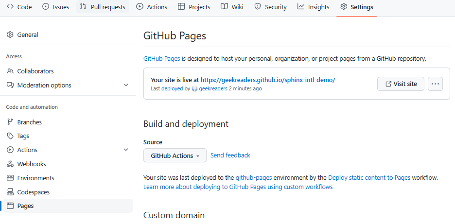

Publish on GitHub Pages
-----------------------

As GitHub documentation says, "GitHub Pages is a static site hosting service that takes files straight from a repository on GitHub, optionally runs the files through a build process, and publishes a website".

Before you publish your documentation on GitHub Pages, make sure your documentation files are in the **zen/_build/html** directory of your repository, like this:

If you created your repository from the demo repository template, all the required files are already in the zen/_build/html directory.

To publish files from this directory on GitHub Pages:

	1. Open your repository settings.
	
	2. Select **Pages**.
	
	3. In the **Build and deployment** section, under **Source**, select **GitHub Actions**.
	
	4. In **Static HTML**, click **Configure**.
	
		.. figure:: _static/GitHub_pages_settings.png
			   :scale: 50 %
			   :align: center
			   :alt: GitHub pages settings
		   
	   GitHub creates a .github/workflows/static.yml file for you.
	
	5. In static.yml file, find the **path** element, it should look like this::
	
			# Upload entire repository
				path: '.'
			
	   Change the path as follows::
	
			# Upload _build/html
				path: './zen/_build/html'
			
		
	.. figure:: _static/static_yml.png
		   :scale: 50 %
		   :align: center
		   :alt: static.yml		

	6. Click **Start commit**, and then **Commit new file**.

	.. figure:: _static/commit_new_file.png
		   :scale: 100 %
		   :align: center
		   :alt: Commiting static.yml	

Once static.yml is committed, GitHub immediately starts publishing your documentation site. The publishing process may take some time, and when it is finished, you can open your documentation by clicking **Visit site** on **Settings -> Pages**:

