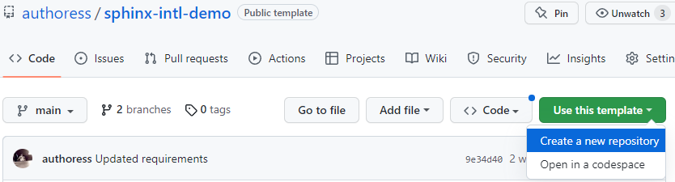

Translate text in .po files
---------------------------

Localization specialists use professional tools to translate real projects:
`CAT <https://en.wikipedia.org/wiki/Computer-assisted_translation>`_
tools,
`TMS <https://en.wikipedia.org/wiki/Translation_management_system>`_
systems etc.
To better understand the .po files structure, we will start with manual translation. 
After that, we will get acquainted with Transifex, one of the popular translation management systems.

Before you start, download `the translation lists <../_static/translation-lists.zip>`_ to get Russian and
Portuguese translations of all texts.

.. note::

	You can :ref:`build the translated documentation <build>` at any time, even if the
	translation is not finished. This helps you see the intermediate result
	and understand :ref:`how gettext works <gettext>`.

Manual translation
~~~~~~~~~~~~~~~~~~

Let’s start from translating our texts into Russian:

1. Open index.po in **locale/ru/LC_MESSAGES** and find these lines::

    #: ../../index.rst:2

    msgid "The Zen of Python"

    msgstr ""

   -  The first line points to the source file and the exact line in it.
   
   -  The second, ``msgid``, is for the source text itself; it also serves as a
      string ID.
   
   -  The third, ``msgstr``, should contain the translation of the string from
      msgid.

2. Put the translation to msgstr like this::

    msgstr "Дзен Питона"

3. Do the same for other strings in index.po and easter-egg.po.

   Note the escape characters in this string::

    msgid "Although never is often better than \\*right\\* now."

   Be careful to keep all such characters as well as the reST notation.
   
   Here is the example of the above string in Russian::

    msgstr "Хотя никогда обычно лучше, чем \\*прямо\\* сейчас."

Once you're done with Russian, repeat the process with index.po 
in **locale/pt_BR/LC_MESSAGES** to translate the project into
Portuguese.
For now, do not translate easter-egg.po into Portuguese, we will use Transifex to translate this file.

You can download `an archive that contains .po files <../_static/po-translated.zip>`_ already translated
into Russian and Portuguese (except for the Portuguese version of easter-egg.po).

Using Transifex
~~~~~~~~~~~~~~~

Sphinx documentation and Readthedocs describe Transifex integration using the Transifex Client. We will use another option: integration with GitHub via Transifex UI.
For this, you will need your own copy of the demo repository on GitHub. 
The easiest way is to use the `sphinx-intl-demo repository <https://github.com/authoress/sphinx-intl-demo>`_  as a template. 
Note that easter-egg.po in locale/pt_br/LC_MESSAGES is intentionally left untranslated.

   Creating a new repository from a template

Now you are ready to integrate Transifex into your translation process.

Create an account and organization
""""""""""""""""""""""""""""""""""

When `creating an account <https://www.transifex.com/signup/open-source/>`_, Transifex invites you to create an Open Source organization or join an existing organization. 
For our demo project, we’ll need a new organization.

.. note::
   It doesn’t matter if you actually work for an organization or own one. On Transifex, organization is just a way to organize your projects.

In short, a user can be an administrator of an organization that owns some projects, and each project includes resources. 
`Learn more about Transifex organizations, projects and resources <https://help.transifex.com/en/articles/6656105-introduction-to-projects-and-resources>`_.

Create a project
""""""""""""""""

When you are done with the account and organization, Transifex invites you to create a project. 
For our demo project, specify the project settings as follows:

* Project name: sphinx-intl-demo (choose another name if you want).
* URL to open source license: specify the path to the license file in your GitHub repository. 
  It should be something like this: ``https://github.com/<your_account>/sphinx-intl-demo/blob/main/LICENSE``
* Project type: File based.
* Source language: English.
* Target languages: Portuguese (Brazil), Russian.

PICTURE

Click **Create project** to finish adding a project.

Integrate Transifex and GitHub
""""""""""""""""""""""""""""""

Integrate your Transifex and GitHub accounts as described in the `Transifex documentation <https://help.transifex.com/en/articles/6265125-github-via-transifex-ui>`_:

#. Go to your organization settings -> Integrations.
#. In the GitHub integration box, click **Authorize** and then **Install the Transifex app**.
   
   PICTURE
#. From the **Select repositories** drop-down menu, select your demo repository, and then click **Install**. 
#. Confirm your GitHub password.
   The Transifex Integration is now installed on your GitHub account.
#. Get back to Transifex and go to your organization settings -> Integrations. 
#. In the Github integration box, click **Authorize** and then **authorize Transifex**.
#. Transifex requires some permissions. Click **Authorize Transifex Integration**.
#. Finish integration by clicking your GitHub account name in the list of available installations.
   
   PICTURE

Your demo repository should now be authorized on Transifex.

Link your Transifex project with GitHub
"""""""""""""""""""""""""""""""""""""""

Link your project with your GitHub demo repository as described in the `Transifex documentation <https://help.transifex.com/en/articles/6265125-github-via-transifex-ui#h_de29ef5cec>`_:

#. Go to your project settings -> Integrations.
#. In the **GitHub** box, click **Link Repository**.
 
   PICTURE
#. On the **Select repo** tab, specify **main** as the branch name, then click **Validate**.

   PICTURE
   
   Click **Next**.
#. On the **Select Files** tab, you need to specify the name of the YML configuration file that defines how the integration works.
   If you have created your repository from the demo template, transifex.yml is already there. Otherwise, create transifex.yml in the root of your repository and put the following content in it::
   
	git:
	  filters:
	  - filter_type: dir
		file_format: PO
		source_file_extension: pot
		source_language: en
		source_file_dir: zen/_build/gettext
		translation_files_expression: 'zen/locale/<lang>/LC_MESSAGES'

   Here, we tell Transifex to take source .pot files from zen/_build/gettext and to put translated .po files to zen/locale/<lang>/LC_MESSAGES, where <lang> is a language code (in our project, it’s either ru or pt_BR).

#. When the transifex.yml file is in the root of your repository, on the **Select Files** tab, click **Apply**.
   
   Click **Next**.
#. On the **Sync Content** tab, select **100% reviewed** and **Create a Pull Request**.
   
   Click **Save & Sync**.

   Your Transifex project is now linked with your GitHub repository.

In Project Integrations, you will find the status of synchronizing source files.

PICTURE

Translate files in Transifex Editor
"""""""""""""""""""""""""""""""""""

To translate easter-egg.po into Portuguese:

#. Go to Transifex Editor by clicking **Editor** at the top of the page.  
#. From the target language drop-down menu, select **Portuguese (Brasil)**.

   PICTURE 
#. In the **Resources Overview** list, click **zen...easter-egg.pot(main)**.
   Transifex Editor opens.
   
   PICTURE   
#. In the strings list on the left, click **Easter Egg**. 
   Put the translation for this string (*Ovo de Páscoa*) into the translation area on the right. 
   
   Click **Save Translation**.
#. Repeat for two other strings.
#. Select all the translated strings by clicking the grouping checkbox on the left.
   In the **Bulk actions** panel on the right, select **Reviewed** from the **Mark as drop-down** menu, and then click **Apply**.
   
   PICTURE
   
All the strings in easter-egg are now translated and reviewed.

`Learn more about Transifex Editor in the documentation <https://help.transifex.com/en/articles/6318216-translating-with-the-web-editor>`_.

Merge pull request on GitHub
""""""""""""""""""""""""""""

Once one of our resources is fully translated and reviewed, Transifex automatically sends it to GitHub by creating a pull request. You can find the information about it on the 
Project Integrations page.

To merge the pull request:

#. On GitHub, go to your demo repository Pull requests.
   
   PICTURE
#. Click the pull request name. The format of pull request names from Transifex is ``Transifex '<path to the source>' in '<language code>'``.
#. On the **Files changed** tab, check that all the translated strings are correct.
#. On the **Conversation** tab, click **Merge pull request**, then **Confirm merge**.
#. After the pull request is merged, you can delete the branch.
   
   PICTURE
   
Now all the texts in .po files are translated.

You can pull the updated .po file from GitHub to build your documentation locally.
